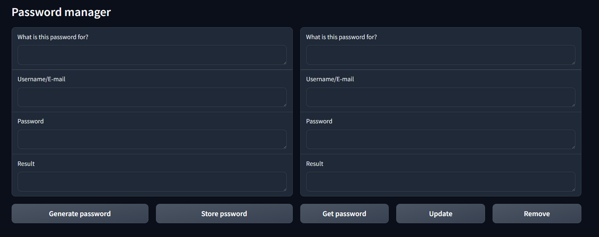
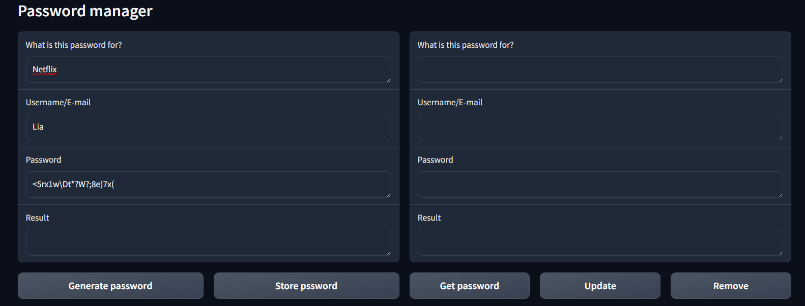
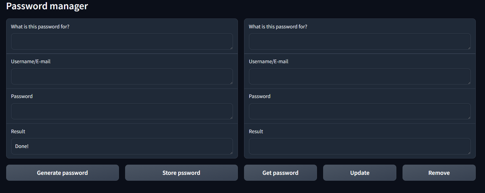
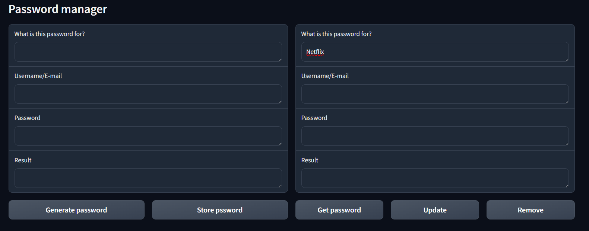
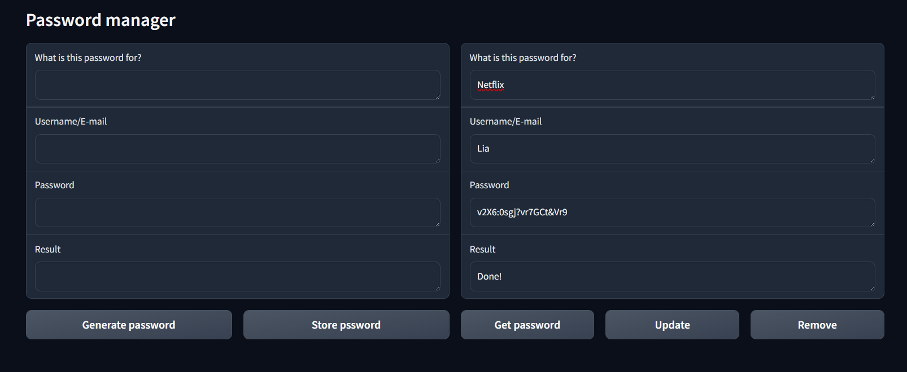
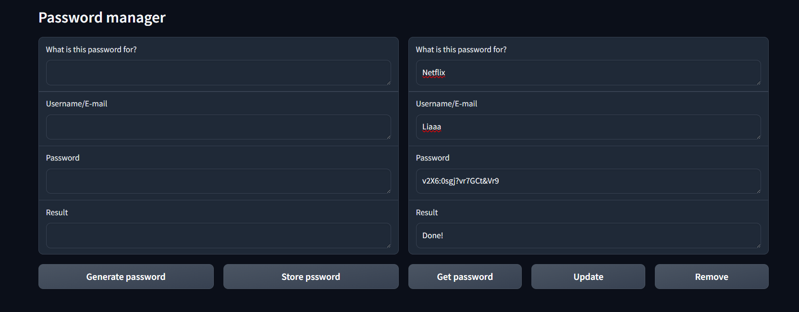
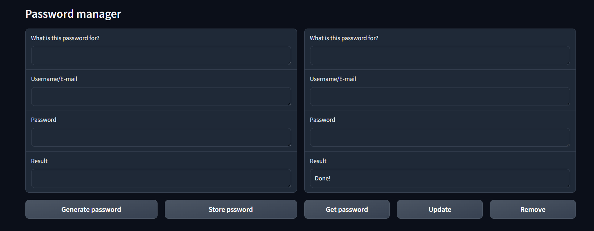
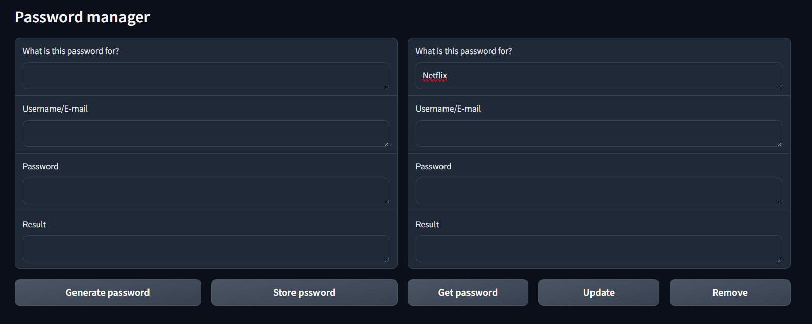
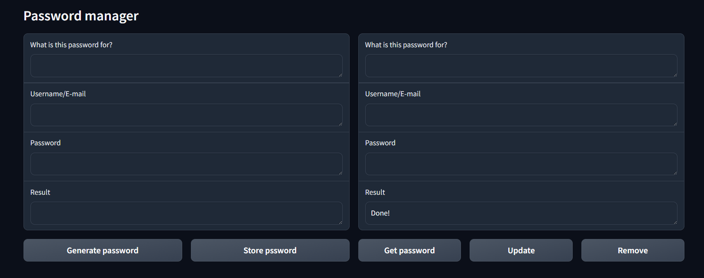
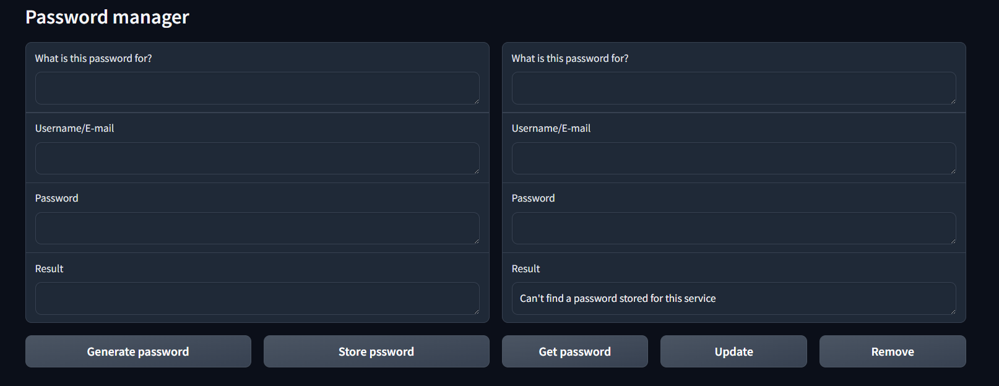

# Password manager

## How to use

To add a password just fill the data in the right column and then press "Store password", you can write your own password or generate it one by clicking "Generate password"

To retrive a password just enter the service name and click "Get password", from that you can update data or just remove them

